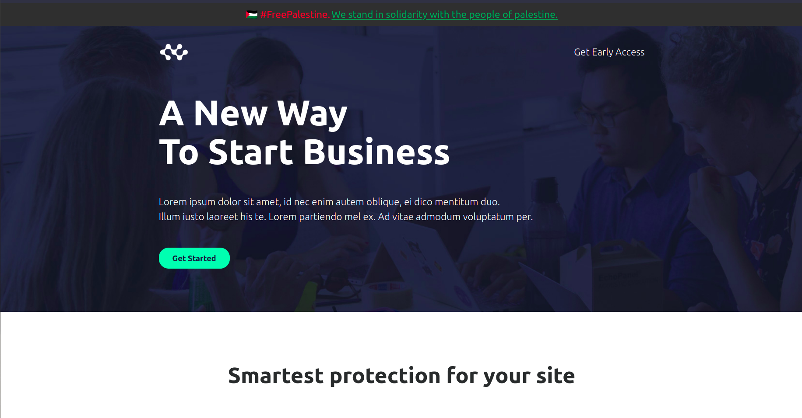

# 🇵🇸 FreePalestine Banner

This is a small javascript library to add a simple banner in your website to show your support for the palestine people, their freedom, their dreams, their life.

## ✏️ How to use

Just use the below code in your website with already pre compiled js files
```html
<script src="https://cdn.jsdelivr.net/gh/zeeshanadnan/free-palestine-banner@main/dist/free-palestine-banner-1.0.1.js"></script>
<script>
  freePalestine.createBanner({position: "bottom-right"});
</script>
```

Currently we just have one simple config to choose position of the banner. Use `top-left` , `top-right`, `bottom-right` or `bottom-left` to choose your banner position.


## Preview


