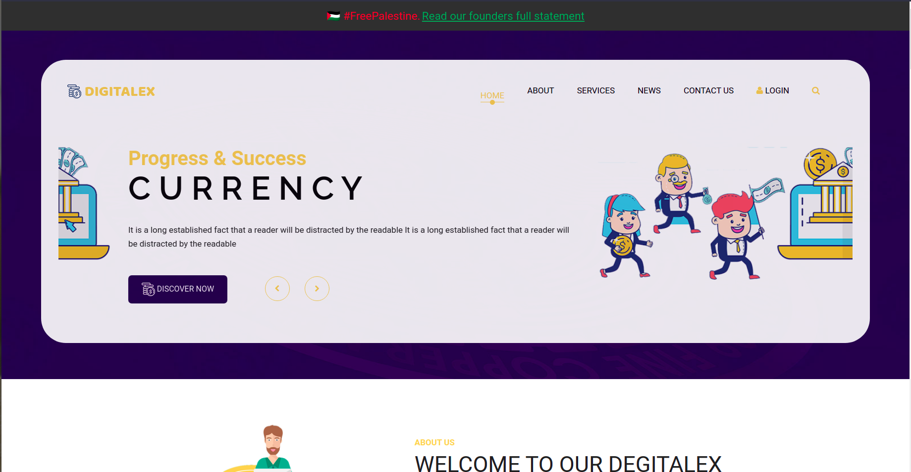

> "Even the birds in Gaza know the story.. they have two wings and do not migrate!" - Youssef Al-Damouki

# 🇵🇸 FreePalestine Banner

This is a small javascript library to add a simple banner in your website to show your support for the people of Palestine, their freedom, their dreams, their life.

## ✏️ How to use

Just use the below code in your website with already pre compiled js files

```html
<script src="https://cdn.jsdelivr.net/gh/zeeshanadnan/free-palestine-banner@main/dist/free-palestine-banner-1.0.0.js"></script>
<script>
  freePalestine.createBanner({
    statement: "We stand in solidarity with the people of palestine.",
    externalLink: "https://blog.paulbiggar.com/i-cant-sleep/",
  });
</script>
```

## Config

| Parameter      | Type         | Description                                                    |
| :------------- | :----------- | :------------------------------------------------------------- |
| `statement`    | `string`     | Put a custom statement or will be set to a default one         |
| `externalLink` | `url string` | If you want to link to some external resource url can put here |

## Preview

### Smaple 1:


### Smaple 2:



## Known issue

If your website have absolute positioned content at top will not probably work correctly.
